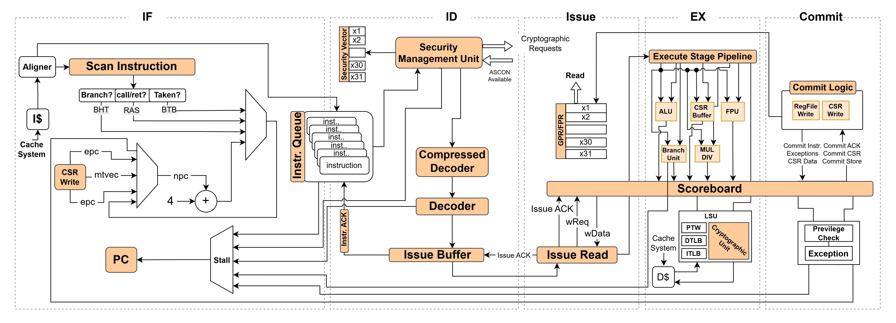

# SEREPA Secure RISC-V CPU 

SEREPA is a 6-stage, single-issue, in-order CPU which implements the 64-bit RISC-V instruction set. It fully implements I, M, A and C extensions as specified in Volume I: User-Level ISA V 2.3 as well as the draft privilege extension 1.10. It implements three privilege levels M, S, U to fully support a Unix-like operating system. Furthermore, it is compliant to the draft external debug spec 0.13.

It has a configurable size, separate TLBs, a hardware PTW and branch-prediction (branch target buffer and branch history table). The primary design goal was on reducing critical path length.




# Quick setup

The following instructions will allow you to compile and run a Verilator model of the SEREPA APU (which instantiates the SEREPA core) within the SEREPA APU testbench (corev_apu/tb).

Throughout all build and simulations scripts executions, you can use the environment variable `NUM_JOBS` to set the number of concurrent jobs launched by `make`:
- if left undefined, `NUM_JOBS` will default to 1, resulting in a sequential execution
of `make` jobs;
- when setting `NUM_JOBS` to an explicit value, it is recommended not to exceed 2/3 of
the total number of virtual cores available on your system.    

1. Checkout the repository and initialize all submodules.
```sh
git clone https://github.com/Mohammad-Ismael/SEREPA.git
cd SEREPA
git submodule update --init --recursive
```

2. Download SEREPA's Toolchain [RISCV](util/toolchain-builder/README.md#Prerequisites), then put it in SEREPA's root directory

:warning: It is **A MUST** to use this toolchain.

3. Install `cmake`, version 3.14 or higher.

4. Set the RISCV environment variable.
```sh
export RISCV=/path/to/toolchain/installation/directory
```

5. Install `help2man` and `device-tree-compiler` packages.

For Debian-based Linux distributions, run :

```sh
sudo apt-get install help2man device-tree-compiler
```

6. Install the riscv-dv requirements:

```sh
pip3 install -r verif/sim/dv/requirements.txt
```

7. Run these commands to install a custom Spike and Verilator (i.e. these versions must be used to simulate the SEREPA) and [these](#running-regression-tests-simulations) tests suites.
```sh
# DV_SIMULATORS is detailed in the next section
export DV_SIMULATORS=veri-testharness,spike
bash verif/regress/smoke-tests-cv64a6_imafdc_sv39.sh
```